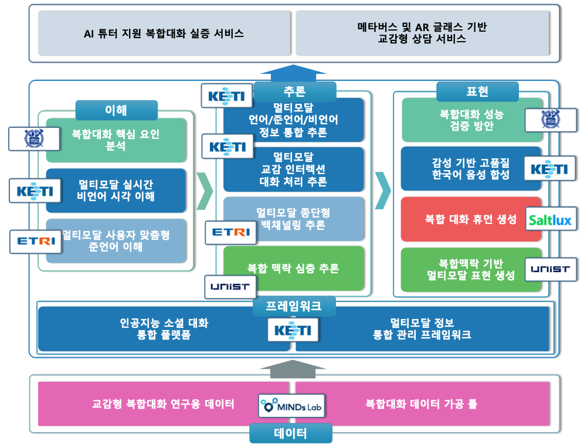

## (1세부) 인간과 교감하는 멀티모달 인터랙션 인공지능 기술

### 목표
  *  **복합 모달의 다양한 표현 요소**들을 언어적인 관점에서 연계 분석하여 **융합된 대화로 모델링**하는 **원천기술 및 실세계 기반 실증** 연구를 수행
     * 표정/동작/음성 등의 **통합 인식**으로 사용자와의 **실시간 실감 인터랙션** 지원
     * 복합 대화의 표출 기반 다양한 **감정 정보를 반영**할 수 있는 **음성 합성**
     * 복합 모달 및 언어레벨에 따른 정보를 활용한 **고차원 사용자 이해** 기술
     * 음성 인식 오류에 강인한 **멀티모달 종단형 준언어 모델 학습** 기술
     * 메타버스 및 AR 글래스 기반 **교감형 상담/비서 서비스**
     * **음성/제수처/표정/다중뷰 등 복합 모달리티** 기반 데이터 구축
     * **복합대화 핵심요인 범주화 기술**을 통한 대화 인터랙션 향상
     * **멀티 모달과 상식 기반으로 이해**하는 표현 모델 개발

### 기간
* 1단계: 2022. 04. 01 ~ 2024. 12. 31 (2년 9개월)
  * **2023년 현재: 1단계 2차년도 연구 수행 중**
* 2단계: 2025. 01. 01 ~ 2026. 12. 31 (2년)
  

### 연구 기관
* 주관연구기관: 한국전자기술연구원
* 공동연구기관: 한국전자기통신연구원, (주)솔트룩스, (주)마인즈랩, 서울대학교 산학협력단, 울산과학기술원
* 국제공동연구: University of Birmingham (UK)

## 통합 Build 방안
> :warning: **주의사항**:  (TBD)

```shell
(TBD)
```


## 공개 SW
| Category | Title | Repository | 기관 |
|-----|-----|-----|-----|
| Inference | Multi-modal Information Integration Understanding Model v1.0 | [Link](https://github.com/AIRC-KETI/VL-KE-T5) | KETI |
| Inference | Information Recognition_verbal | [Link](https://github.com/MMC-K/Empathetic-Dialog-verbal) | KETI |
| Inference | Empathetic Dialog_verbal | [Link](https://github.com/MMC-K/Information-Recognition-verbal) | KETI |
| Representation | Text-to-Synthesis Baseline | [Link](https://github.com/beckgom/zero-shot_tts) | KETI |
| Understanding | Backchannel Prediction | [Link](https://github.com/etri/etri-miai) | ETRI |


## 연구 논문
> :warning: **작성 주의사항**:  최신 공개 내용을 상단으로 정렬해주세요.

| Authors | Title | Publication | Affiliation | Link |
|-----|-----|-----|-----|-----| 
| (TBD) | (TBD) | (TBD) | (TBD) | (TBD) |


## Acknowledge 
> This work was supported by Institute of Information & communications Technology Planning & Evaluation (IITP) grant funded by the Korea government(MSIT) (No.2022-0-00608, Artificial intelligence research about multi-modal interactions for empathetic conversations with humans)

